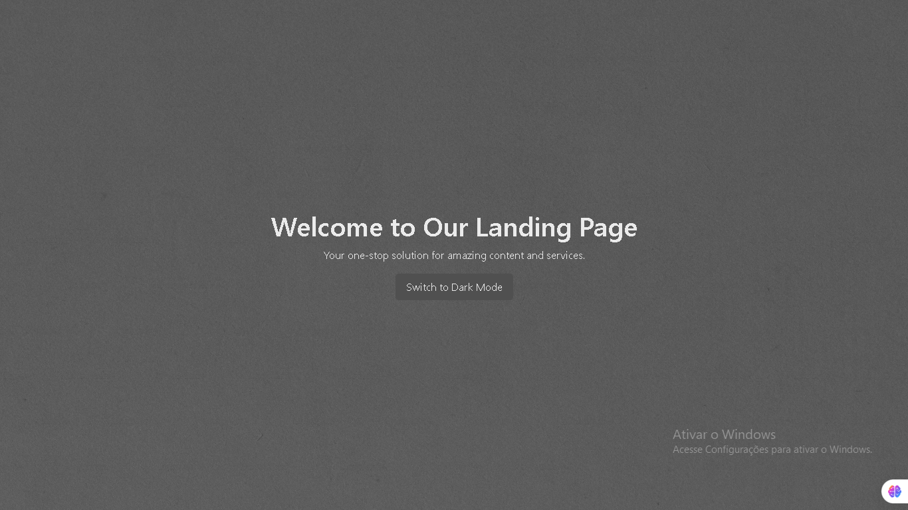

# React Landing Page

## Introduction

The **React Landing Page** project is a modern and minimalistic template designed for websites focused on marketing, news, blogs, or portfolios. Built using **React** and **TypeScript**, it incorporates **Bootstrap components** to ensure high performance and rapid delivery while maintaining a clean and elegant interface.

<p align="center">
  
</p>

## Features

- **Dark Mode Toggle**: Switch between light and dark themes seamlessly.
- **Responsive Carousel**: Showcase images or content with customizable sizes, powered by Bootstrap.
- **Hero Section**: A bold introduction area for grabbing user attention.
- **Customizable Sections**: Add and modify sections to meet your needs.
- **Minimalistic Design**: Simple yet professional aesthetics for optimal user experience.

## Technologies Used

- **React** + **TypeScript**: Core technologies for robust and maintainable code.
- **Bootstrap**: Provides responsive and reusable components.
- **CSS**: Custom styling for fine-tuning the design.

## Page Sections

### Hero Section
The landing page begins with a captivating hero section featuring a title, a short description, and a button to toggle between light and dark modes.

### About Us
An overview of the company or project, explaining its mission and the value it provides to users.

### Services
A detailed description of the services offered, designed to engage and inform potential clients or users.

### Carousel Section
A dynamic carousel to showcase images or content. Fully responsive and easily customizable in size.

### Footer
A simple footer that includes copyright information and can be expanded with additional links or contact details.

## Project Structure

### Main Code

#### App.tsx
```tsx
import React, { useState } from 'react';
import Carousel from './components/Carousel/Carousel';
import './index.css';

const App: React.FC = () => {
  const [darkMode, setDarkMode] = useState(false);

  const toggleTheme = () => {
    setDarkMode(!darkMode);
    document.body.classList.toggle('dark-mode', !darkMode);
  };

  return (
    <div className="hero-container">
      <section className="hero">
        <div>
          <h1>Welcome to Our Landing Page</h1>
          <p>Your one-stop solution for amazing content and services.</p>
          <button className="button" onClick={toggleTheme}>
            Switch to {darkMode ? 'Light' : 'Dark'} Mode
          </button>
        </div>
      </section>
      <main>
        <section>
          <h2>About Us</h2>
          <p>
            Our mission is to deliver high-quality solutions that cater to your needs. We specialize in designing professional, efficient, and visually appealing websites that resonate with your audience.
          </p>
          <p>
            With a focus on simplicity and usability, our landing pages are the perfect tool for showcasing content, marketing campaigns, and portfolios.
          </p>
        </section>

        <section>
          <h2>Our Services</h2>
          <p>
            We offer web development, digital marketing, and portfolio designs tailored to your goals. Our services are aimed at boosting your online presence and enhancing user engagement.
          </p>
          <p>
            Whether you're launching a new product or expanding your brand, our solutions are designed to provide maximum impact.
          </p>
        </section>

        <section>
          <Carousel />
        </section>
      </main>
      <footer>
        <p>&copy; 2024 Your Company. All rights reserved.</p>
      </footer>
    </div>
  );
};

export default App;
```

## Getting Started

1. Clone the repository:
   ```bash
   git clone https://github.com/AndreVsc/react-lading-page.git
   ```
2. Install dependencies:
   ```bash
   npm install
   ```
3. Run the development server:
   ```bash
   npm start
   ```

## References

- [React Documentation](https://reactjs.org/docs/getting-started.html)
- [TypeScript Documentation](https://www.typescriptlang.org/docs/)
- [Bootstrap Documentation](https://getbootstrap.com/docs/)

## Contact

For more information, feel free to reach out via email: **vsandre40@gmail.com**.
